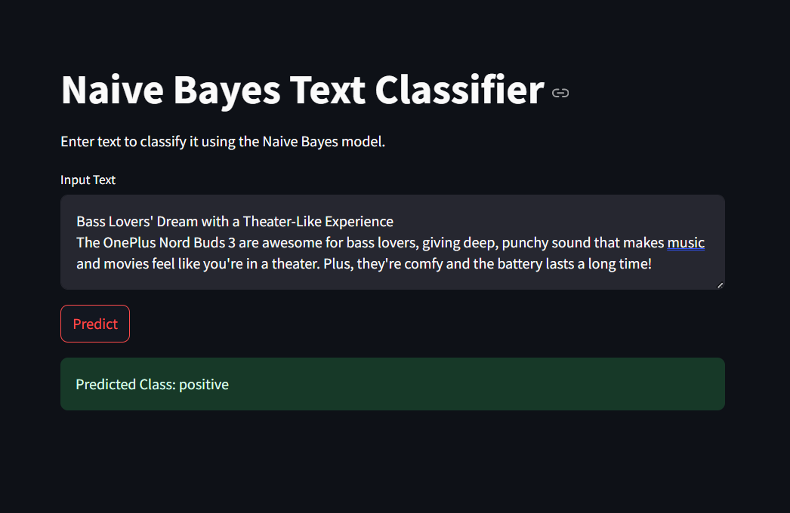
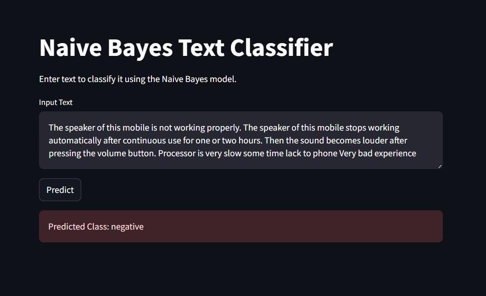
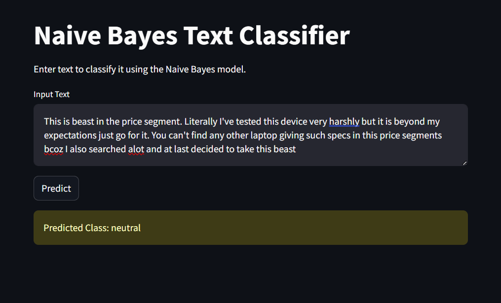

# Naive Bayes Text Classifier

This is a simple Streamlit application that uses a Naive Bayes model to classify input text as either "positive" or "negative". The model is trained on a dataset and utilizes a Count Vectorizer for feature extraction.

## Table of Contents
- [Features](#features)
- [Requirements](#requirements)
- [Installation](#installation)
- [Usage](#usage)
- [Contributing](#contributing)

## Features
- User-friendly interface for text input.
- Classifies text into "positive" or "negative" categories.
- Displays classification results dynamically.

## Requirements
To run this application, you'll need:
- Python 3.10
- Streamlit
- scikit-learn
- numpy
- pickle 

You can install the required libraries using pip:

```bash
pip install streamlit scikit-learn numpy
```
## Installation
1. Clone this repository:

```bash
git clone https://https://github.com/iamakash-ai/Sentiment-Analysis-using-Machine-Learning.git
```
2. Navigate into the project directory:
```bash
cd Sentiment-Analysis-using-Machine-Learning
```
Ensure you have the model and vectorizer files:

naive_bayes_model.pkl
count_vectorizer.pkl
Make sure these files are in the project directory.

## Usage
Start the Streamlit app:

```bash
streamlit run app.py
```
Replace app.py with the name of your Python file if it's different.

Open your browser and navigate to the URL provided in the terminal (usually http://localhost:8501).

Enter the text you want to classify in the text area and click the "Predict" button.

The app will display the predicted class: "positive" or "negative".
<div style="display: flex; justify-content: space-between;">
  <div style="flex: 1; text-align: center;">
    
    <p>Image Description 1</p>
  </div>
  <div style="flex: 1; text-align: center;">
    
    <p>Image Description 2</p>
  </div>
  <div style="flex: 1; text-align: center;">
    
    <p>Image Description 3</p>
  </div>
</div>


